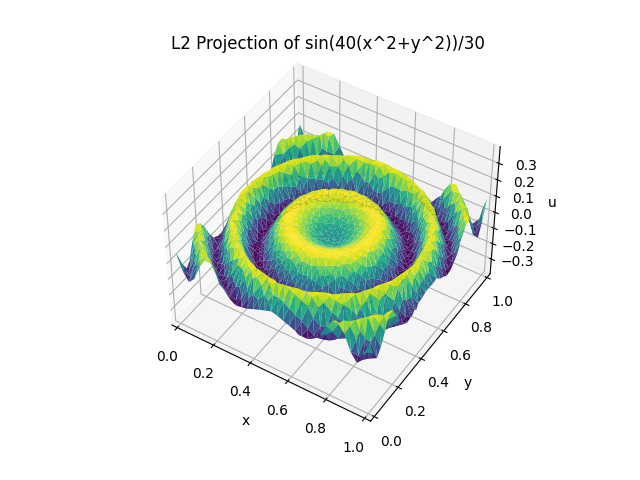
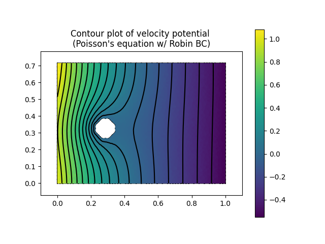

# Finite Element Solver

Finite element method solver for partial differential equations (PDEs) on arbitrary 2d meshes. 

- Can solve the following equations:
    - L2 projection
    - Poisson equation
    - Heat equation
    - Wave equation
    - **Linear elastic mechanics**
- With customizable boundary conditions (Dirichlet, Neumann, Robin) and arbitrary source functions.
- Visualization with colormap and contour plots
- Various quadrature rules

## Examples
### L2 Projection
Given a function f(x, y), we can find its best approximation in the finite element space, which is the space of linear functions on the triangular mesh.

### Poisson Equation
Poisson's equation is a partial differential equation that can be used to model heat transfer, electrostatics, fluid flow, and other phenomena. It is defined as $\Delta u = f$, where f is a given function and u is the unknown function we are trying to solve for. 

Using the finite element method, we can solve for u by finding the weak form of the equation and discretizing it into a linear system. 

This example shows the velocity potential u (where gradient of velocity potential = flow velocity) of fluid flow around an obstacle. The Robin boundary conditions are: u = 0 on the obstacle, and du/dn = 3 on left inlet and du/dn = -1 on the right outlet. 

<!-- ### Wave Equation -->

### Linear Elastic Mechanics
The linear elastic mechanics solver can solve for the displacement and stress field of a solid object given applied forces and boundary conditions. 

The starting mesh is a supported cantilever beam. We fix the left edge and apply a downward force on the right most edge, and a uniform body force due to gravity.

The resulting deformed mesh shows the beam bending under the forces with a max stress at the corner of the support. 

Note: This example shows extreme displacement, in reality, the object would no longer be in the linear elastic regime and the solver would not be accurate.

## Todo
    - Add thermal expansion to linear elastics model
    - Solve transport equations, fluid mechanics, etc.
    - Adaptive mesh refinement
    - Better examples (and examples for all PDEs)
    - Calculate mesh gradients, energies, etc.
    - Expand to a 3d solver

    - ORGANIZE CODE

### References
Algorithms are based on the book *The Finite Element Method: Theory, Implementation, and Applications* by Mats G. Larson and Fredrik Bengzon.