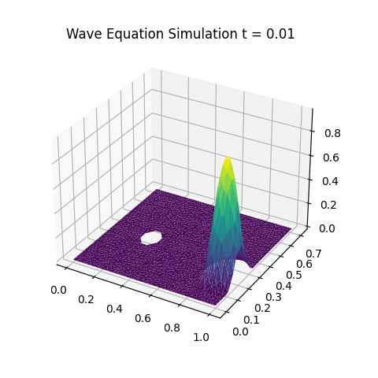
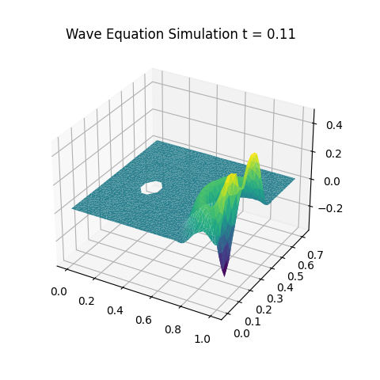
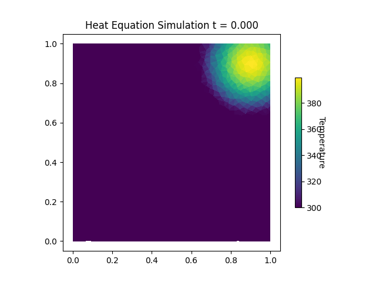
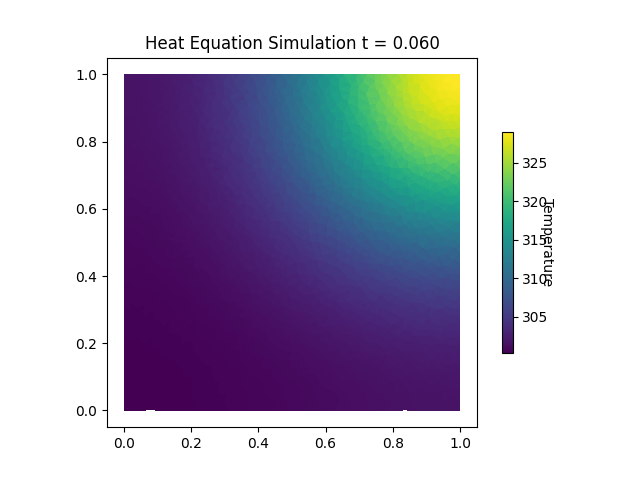
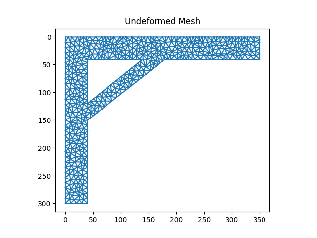
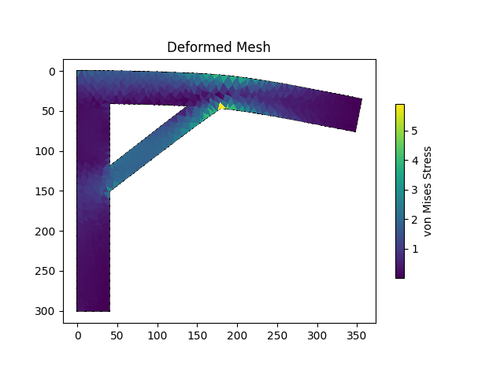
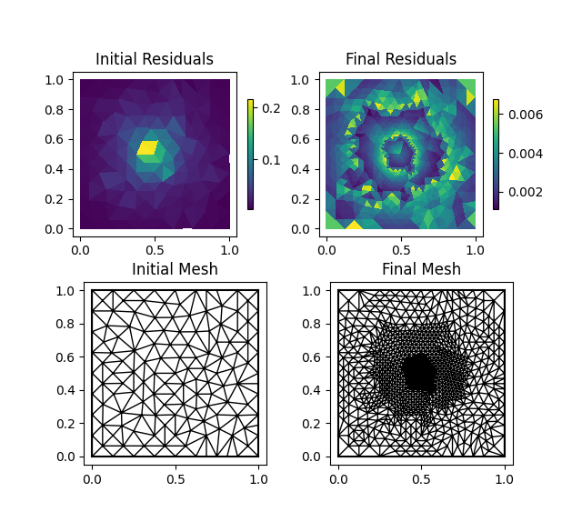
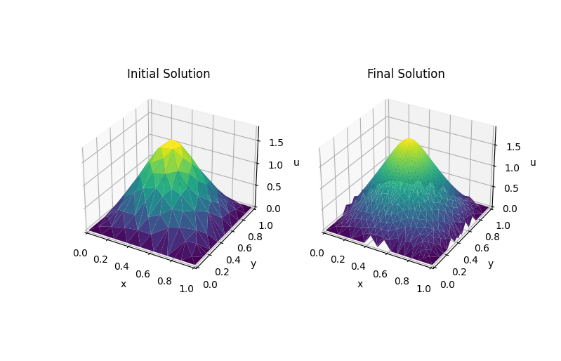
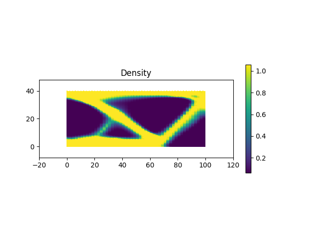

# Finite Element Solver

Finite element method solver for partial differential equations (PDEs) on arbitrary 2d meshes. 

## Features

- Can solve the following equations:
    - L2 projection
    - Poisson equation
    - Heat equation
    - Wave equation
    - **Linear elastic mechanics**
- Customizable boundary conditions (Dirichlet, Neumann, Mixed) and arbitrary load functions
- **Adaptive mesh refinement**
- **Topology optimization** for structural design
- Custom generated meshes from my "Meshing" project

## Equations
### L2 Projection
Given a function $f(x, y)$, we can find its best approximation in the finite element space, which is the space of linear functions on the triangular mesh.

### Poisson's Equation
Poisson's equation is a partial differential equation that can be used to model heat transfer, electrostatics, fluid flow, and other phenomena. It is defined as $\Delta u = f$, where $f$ is a given function and $u$ is the unknown function we are trying to solve for. 

Using the finite element method, we can solve for $u$ by finding the weak form of the equation and discretizing it into a linear system. 

This example shows the velocity potential $u$ (where gradient of velocity potential = flow velocity) of fluid flow around an obstacle. The Robin boundary conditions are: $u = 0$ on the obstacle, and $n \cdot \Delta u = \frac{du}{dx} = 3$ on left inlet and $n \cdot \Delta u = -\frac{du}{dx} = -1$ on the right outlet. 

### Wave Equation
The wave equation is a partial differential equation that describes waves as they propogate through space and time. It is defined as $\frac{\partial^2 u}{\partial t^2} = c^2 \Delta u$, where $c$ is the wave speed and $u$ is the scalar function describing the wave.

We can simulate the wave propogation over time with Crank-Nicolson integration, solving for $u$ at each timestep.

    
    

The wave starts as a single pulse and propogates outwards at a constant speed. When it collides with the boundary, it reflects back and interferes with itself, creating a standing wave pattern.
<!-- TODO: add bc -->

### Heat Equation
The heat equation is a partial differential equation that describes the distribution of heat over time. It is defined as $\frac{\partial u}{\partial t} = \alpha \Delta u$, where $\alpha$ is the thermal diffusivity and $u$ is the temperature.

We can simulate the heat distribution over time with Backwards Euler integration, solving for $u$ at each timestep.

    
    

In this example, there is an initial high temperature bump in the corner of the domain. The heat diffuses outwards and eventually will reach a steady state where the temperature is constant. Heat is conserved in this simulation, where the mean temperature of the domain is constant over time.

### Linear Elastic Mechanics
The linear elastic mechanics solver can solve for the displacement and stress field of a solid object given applied forces and boundary conditions. 

The starting mesh is a supported cantilever beam. We fix the left edge and apply a downward force on the right most edge, and a uniform body force due to gravity.

The resulting deformed mesh shows the beam bending under the forces with a max stress at the corner of the support. 

Note: This example shows extreme displacement, in reality, the object would no longer be in the linear elastic regime and the solver would not be accurate.

## Adaptive Refinement

The solver can also perform adaptive mesh refinement to increase the accuracy of the solution. It works by calculating the a posteriori error estimate of each element and refining the elements with the largest error. We maintain the triangle quality of the mesh with regular (red-green) refinement.

Here, we show adaptive refinement on solving Poisson's equation.

We can see that the residual error is concentrated near the center of the domain, so the solver refines the mesh in that area. The final mesh has a much higher resolution in the center and much lower residual error.

## Topology Optimization

Topology optimization is a method of structural design where the material distribution of a structure is optimized to minimize some objective function. In this case, we are minimizing the compliance of the structure, which is the amount of deformation under a given load.

The boundary conditions are that the left edge is fixed and a downward force is applied to the right edge. The material distribution is represented by a density field, where 0 is no material and 1 is full material. The solver uses the SIMP (Solid Isotropic Material with Penalization) method to penalize intermediate densities.

The solver starts with a uniform density field and iteratively updates the density field to minimize the compliance. This image shows the final density field. This structure reduces maximum displacement by over 70% compared to the uniform density structure.

(More details with images of deformation, post-processed mesh, etc. coming soon)

## Methods

 - Galerkin Finite Element Method
 - Boundary conditions: Dirichlet, Neumann, Robin, Mixed
 - Physical models (PDEs): L2 projection, Poisson's equation, Heat equation, Wave equation, Navier-Cauchy equation for linear elastic mechanics
 - Quadrature: Midpoint, Trapezoidal, Simpson's
 - Integration: Forward/Backward Euler, Crank-Nicolson
 - Smoothing: Laplacian smoothing
 - Refinement: Red-Green regular refinement
 - Energy measures: Dirichlet energy, Kinetic energy
 - Error estimates: A posteriori error residuals
 - Optimization: Gradient descent
 - Mesh data structures: Half-edge triangle mesh

## Todo
    - Add thermal expansion to linear elastics model
    - Solve transport equations, fluid mechanics, etc.
    - Adaptive refinement for all equations
    - Expand to a 3d solver
    - Sparse solver

### References
*The Finite Element Method: Theory, Implementation, and Applications* by Mats G. Larson and Fredrik Bengzon.

[*SIMP Method for Topology Optimization*](https://help.solidworks.com/2019/english/solidworks/cworks/c_simp_method_topology.htm) by Dassault Systèmes.
