# Finite Element Solver

[](https://github.com/janetyq/Finite-Element-Solver/actions/workflows/ci.yml)
[](https://janetyq.github.io/Finite-Element-Solver/)

This finite element method (FEM) solver is capable of solving a variety of partial differential equations (PDEs), such as Poisson, heat, wave, and both linear and nonlinear elasticity equations. It supports both Dirichlet and Neumann boundary conditions and can be applied to simulate both 2D and 3D meshes. Interesting features include custom meshing algorithms, adaptive mesh refinement to enhance simulation accuracy and topology optimization for optimizing structural design.

### ▶ [See it running — the demo gallery](https://janetyq.github.io/Finite-Element-Solver/)

## Installation

The project uses [uv](https://docs.astral.sh/uv/) for environment and dependency
management. `uv sync` creates a project-local `.venv`, installs the `fem` package
in editable mode, and pins exact versions in `uv.lock`.

```bash
uv sync   # core solver, SVG-outline meshing, 3D tetrahedral meshing/rendering, and dev tools (pytest)
```

Prefer plain pip? It is a standard `pyproject.toml` package:
```bash
pip install -e .
```

## Quick Start

```python
from fem import Mesh, BoundaryConditions, BCType, Solver, Poisson, Plotter
from fem.regions import everywhere

mesh = Mesh.load("files/mesh_40x40.json")   # geometry only

# The source term f is data of the equation; the boundary conditions describe
# only the boundary, and do so geometrically -- so the same `bc` is valid on any
# mesh, including one produced by adaptive refinement.
equation = Poisson(source=1)
bc = BoundaryConditions()
bc.add(BCType.DIRICHLET, everywhere(), 0)

# Solver picks the element type off the connectivity and derives the DOFs per
# node from the equation, so it builds its own FunctionSpace over the mesh.
solution = Solver(mesh, equation, bc).solve()

plotter = Plotter(title="Poisson")
plotter.plot(mesh, solution.u, mode="surface")
plotter.show()
```

A solution is a typed dataclass, so its fields are attributes rather than string
keys. An elastic solve returns an `ElasticSolution`, which carries the recovered
stress and strain as full tensors and derives the scalar measures on demand:

```python
solution = Solver(mesh, LinearElastic(E=200, nu=0.3), bc).solve()

solution.u                 # (n_vertices * n_components,) displacement
solution.stress            # (n_elements, 3, 3) Cauchy stress tensors
solution.von_mises         # (n_elements,) equivalent stress -- the usual plot
solution.principal_stress  # (n_elements, 3) principal values, ascending
solution.compliance        # (n_elements,) strain energy per element
```

The tensors are stored and the scalars computed, not the other way round: a
reduction to one number is a choice, and reducing at construction would fix
which question the result can answer. `fem/invariants.py` holds those
reductions; each is rotation-invariant, which a norm taken over the packed Voigt
components used in assembly is not.

## Project Structure

A solve is a composition assembled from parts, not a method looked up by PDE
name, so the package is grouped by the job each object does. `ARCHITECTURE.md`
is the full account; this is the map.

```
fem/                 # the solver package
├── mesh/            # Mesh geometry, generation, red-green refinement, SVG outlines
├── plot/            # Plotter, 2D drawing helpers, 3D tet rendering
│
│   # discretization -- what functions can be represented
├── elements.py      # stateless element types + batched ElementGeometry
├── space.py         # FunctionSpace: DOF numbering, cached operators, assembly
│
│   # physics -- what equation, what material
├── equations.py     # Equation: Projection, Poisson, LinearElastic
├── forms.py         # Form/EnergyForm integrands; derived-field recovery
├── materials.py     # Hooke's law, Lame conversions (2D is plane strain)
├── energies.py      # hyperelastic strain-energy densities and their derivatives
├── fields.py        # Scalar/Vector: components per node, resolved against the mesh
│
│   # constraints
├── boundary.py      # BoundaryConditions spec -> ResolvedBC for one mesh
├── regions.py       # position-based regions and fields (on_plane, in_box, ...)
│
│   # composition and algebra
├── problem.py       # Problem: space + operator + load + constraints
├── solve.py         # LinearSolve / NewtonSolve strategies
├── system.py        # DiscreteSystem: Dirichlet elimination, factor once
├── backends.py      # DirectBackend (sparse LU) / IterativeBackend (AMG-CG)
├── integrators.py   # ThetaMethod (1st order), NewmarkMethod (2nd order)
│
│   # facades and drivers
├── solver.py        # Solver: the steady linear facade
├── energy_solver.py # EnergySolver: the nonlinear facade
├── adaptivity.py    # AdaptiveRefinement driver
├── topology.py      # SIMP topology optimization driver
│
│   # results
├── solution.py      # typed Solution hierarchy; ElasticSolution.from_solve
├── invariants.py    # rotation-invariant tensor reductions (von Mises, ...)
├── io.py            # mesh JSON, solution npz (no pickle)
│
├── geometry.py, numerics.py, typing.py   # helpers and semantic array aliases
└── quadrature.py    # standalone rules, not yet wired into assembly
tests/               # pytest suite (unit, convergence, integration smoke)
examples/            # runnable demo scripts
files/               # example meshes and SVG outlines
```

## Running Tests

```bash
uv run pytest
```

## Demos

Runnable demos live in `examples/` (run from the repo root) behind a small CLI:
```bash
uv run python examples/cli.py list          # see every available demo
uv run python examples/cli.py run poisson   # run one by name
uv run python examples/cli.py gallery       # render them all as a browsable site
```

The [gallery](https://janetyq.github.io/Finite-Element-Solver/) is that last command,
run on every push to `main`, so it always shows what the demos do now. The figures
further down predate the current `examples/` and several are on richer domains than the
demos build today (a braced bracket, a plate with an obstacle, a 100x40 beam); the
gallery is the reproducible view of the same physics.

## Details
This solver uses the Galerkin finite element method with linear basis functions on triangular meshes for 2D problems and tetrahedral meshes for 3D. It is designed to be modular, making it easy to add new PDEs, finite element types, or energy density functions.

## Examples
### L2 Projection
Given a function $f(x, y)$, we can find its best approximation in the finite element space, which is the space of linear functions on the triangular mesh.

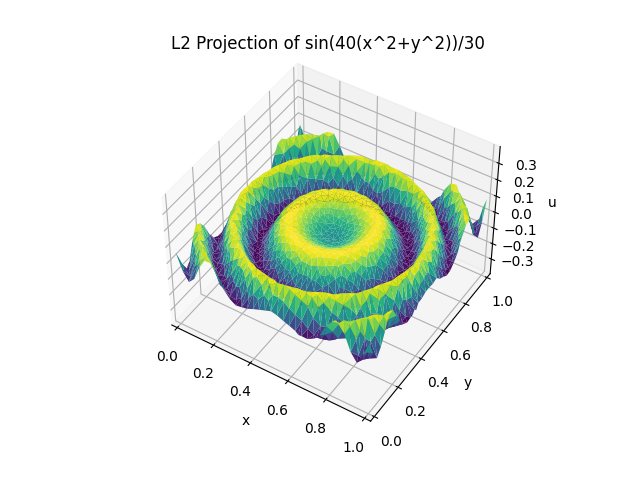

### Poisson's Equation
Poisson's equation is a partial differential equation that can be used to model heat transfer, electrostatics, fluid flow, and other phenomena. It is defined as $\Delta u = f$, where $f$ is a given function and $u$ is the unknown function we are trying to solve for. 

Using the finite element method, we can solve for $u$ by finding the weak form of the equation and discretizing it into a linear system. 

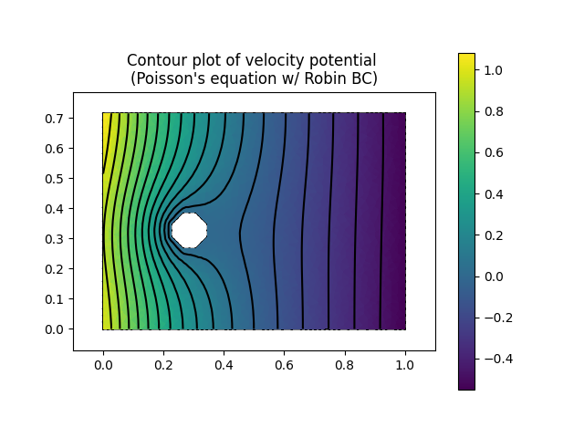

This example shows the velocity potential $u$ (where gradient of velocity potential = flow velocity) of fluid flow around an obstacle. The boundary conditions are mixed: Dirichlet $u = 0$ on the obstacle, and Neumann $n \cdot \nabla u = 3$ on the left inlet and $n \cdot \nabla u = -1$ on the right outlet. (This figure predates the current `examples/`. The mesh it needs now exists — the `stress_concentration` demo builds one and separates the obstacle rim from the outer wall — but nothing yet solves this problem on it.)

For a **Robin** condition ($\partial u/\partial n + \kappa u = g$, contributing to both the operator and the load), see the `robin` demo: a heated plate cooled through a convective boundary, sweeping $\kappa$ from nearly insulated to the Dirichlet limit.

### Wave Equation
The wave equation is a partial differential equation that describes waves as they propogate through space and time. It is defined as $\frac{\partial^2 u}{\partial t^2} = c^2 \Delta u$, where $c$ is the wave speed and $u$ is the scalar function describing the wave.

We can simulate the wave propogation over time by solving for $u$ at each timestep. Being second order in time, it is integrated with Newmark's average-acceleration method rather than the theta-method used for the first-order systems.

<div style="display: flex; justify-content: space-between;">
    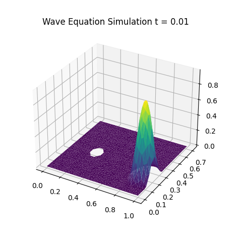
    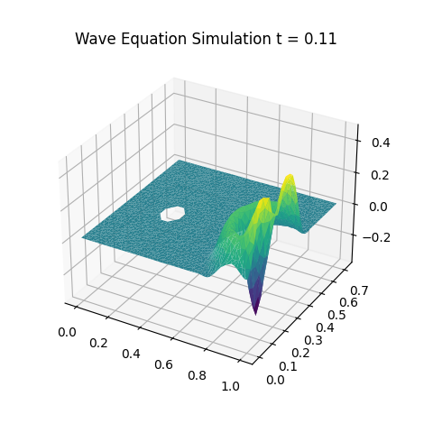
</div>

The wave starts as a single pulse and propogates outwards at a constant speed. When it collides with the boundary, it reflects back and interferes with itself, creating a standing wave pattern.
<!-- TODO: add bc -->

### Heat Equation
The heat equation is a partial differential equation that describes the distribution of heat over time. It is defined as $\frac{\partial u}{\partial t} = \alpha \Delta u$, where $\alpha$ is the thermal diffusivity and $u$ is the temperature.

We can simulate the heat distribution over time with the theta-method, solving for $u$ at each timestep. $\theta = 1$ is backward Euler; the `heat` demo takes the default $\theta = \tfrac{1}{2}$, which is Crank-Nicolson.

<div style="display: flex; justify-content: space-between;">
    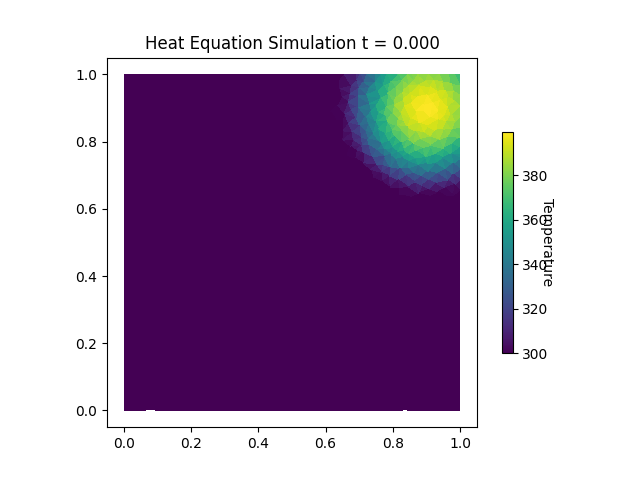
    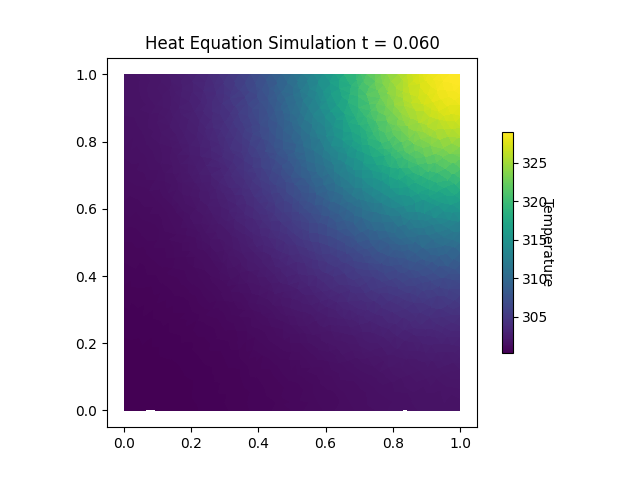
</div>

In this example, there is an initial high temperature bump in the corner of the domain. The heat diffuses outwards and eventually will reach a steady state where the temperature is constant. Heat is conserved in this simulation, where the mean temperature of the domain is constant over time.


### Linear Elastic Mechanics
The linear elastic mechanics solver can solve for the displacement and stress field of a solid object given applied forces and boundary conditions. 

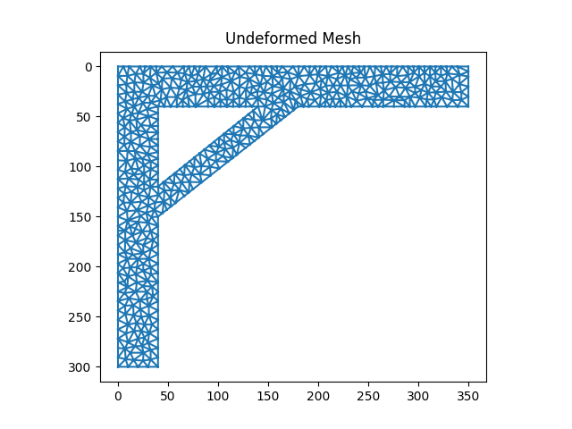

The starting mesh is a supported cantilever beam. We fix the left edge and apply a downward force on the right most edge, and a uniform body force due to gravity.

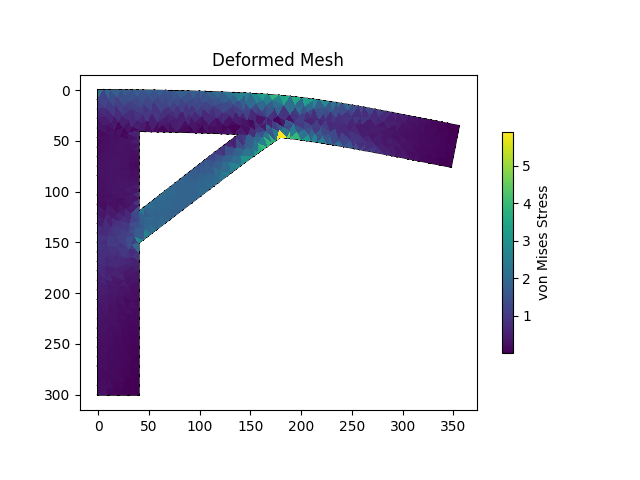

The resulting deformed mesh shows the beam bending under the forces with a max stress at the corner of the support. 

Note: This example shows extreme displacement, in reality, the object would no longer be in the linear elastic regime and the solver would not be accurate.

## Buckling Analysis

A slender column under compression does not fail by crushing -- it snaps sideways into a
bent shape once the load crosses a critical value. `BucklingSolver` finds that value and
the shapes it buckles into by *linearised (eigenvalue) buckling*: a reference load sets up
a prestress, the geometric stiffness `K_g` assembled from it competes with the elastic
stiffness `K`, and the generalized eigenproblem `K φ = -λ K_g φ` gives the critical load
factors `λ` and the buckling modes `φ`.

The `buckling` demo validates this against Euler's column theory three ways: a pinned
column buckles into half-sine waves at loads rising as `n²`; the four classic end
conditions recover their effective-length factors (`K = 2` cantilever, `1` pinned-pinned,
`0.5` fixed-fixed, `~0.7` fixed-pinned) to within a couple of percent; and the critical
load falls as `1/L²`, landing on `π²E*I/L²`. The geometric stiffness is the same
initial-stress term that makes the St-Venant-Kirchhoff energy geometrically nonlinear, so
buckling is the linearisation of the ellipticity loss that model shows under compression.

## Adaptive Refinement

The solver can also perform adaptive mesh refinement to increase the accuracy of the solution. It works by taking a per-element error estimate and refining the elements with the largest error, maintaining triangle quality with regular (red-green) refinement.

`AdaptiveRefinement` takes the estimate as an injected callable `(solver) -> per-element error`, and the refine/remesh loop around it is complete. **The estimator itself is not yet implemented** — the images below were produced by an earlier version. The `refinement` demo shows the two ends of the loop, the peaked problem and the red-green splitting, without the join. See `BACKLOG.md`.

Here, we show adaptive refinement on solving Poisson's equation.

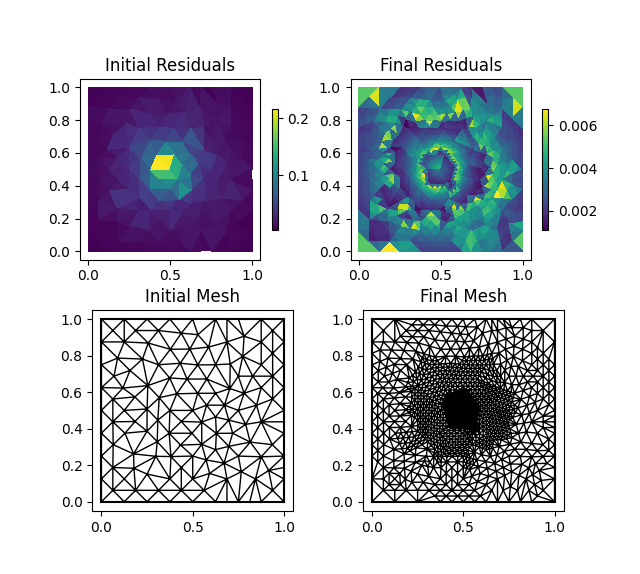

We can see that the residual error is concentrated near the center of the domain, so the solver refines the mesh in that area. The final mesh has a much higher resolution in the center and much lower residual error.

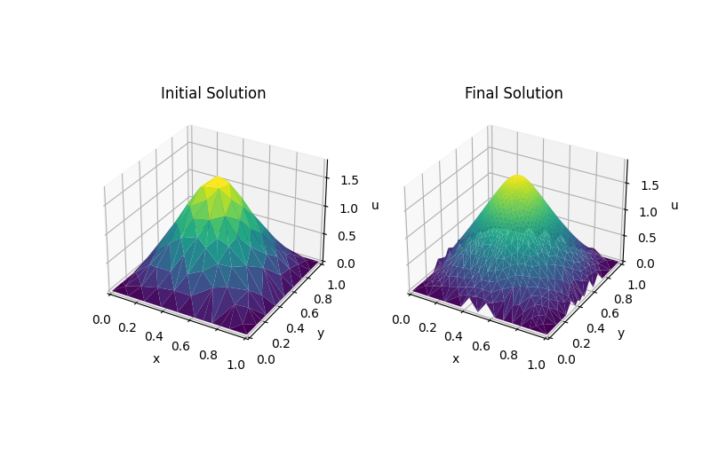

## Topology Optimization

Topology optimization is a method of structural design where the material distribution of a structure is optimized to minimize some objective function. In this case, we are minimizing the compliance of the structure, which is the amount of deformation under a given load.

The boundary conditions are that the left edge is fixed and a downward force is applied to the right edge. The material distribution is represented by a density field, where 0 is no material and 1 is full material. The solver uses the SIMP (Solid Isotropic Material with Penalization) method to penalize intermediate densities.

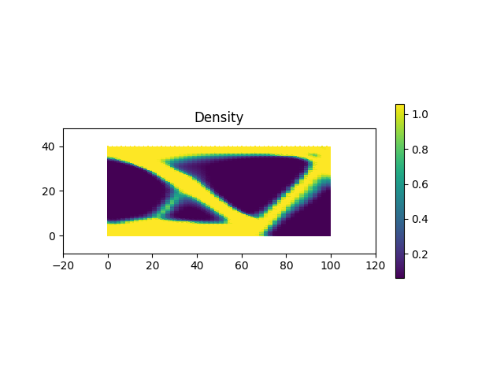

The solver starts with a uniform density field and iteratively updates the density field to minimize the compliance. This image shows the final density field. This structure uses approx 55% of the original material and only deforms slightly more.

The iterations are also recorded as a video — [`images/topopt.mp4`](images/topopt.mp4) — and the [gallery page](https://janetyq.github.io/Finite-Element-Solver/topology_optimization.html) plays the current demo's run frame by frame. (A `<video>` tag with a repository-relative source does not render on GitHub, which is why this is a link.)


## Methods
 - Galerkin Finite Element Method: P1 (linear) basis on triangles and tetrahedra,
   and P2 (quadratic) triangles for O(h³) accuracy, over a Gaussian quadrature layer
 - Boundary conditions: Dirichlet, Neumann, Robin
 - PDEs: L2 projection, Poisson, variable-coefficient diffusion, heat, wave,
   Navier-Cauchy (linear elasticity), St Venant-Kirchhoff hyperelasticity
 - Kinematics: infinitesimal strain, or geometrically exact Green-Lagrange
   (2D elasticity is **plane strain**)
 - Time integration: theta-method (backward Euler, Crank-Nicolson) for first-order
   systems; Newmark average-acceleration for second-order
 - Linear algebra: sparse throughout -- direct (`splu`) by default, or
   AMG-preconditioned CG for large SPD systems, with rigid-body near-kernel for
   elasticity
 - Derived fields: Cauchy stress and strain tensors, von Mises, principal stresses,
   compliance
 - Stability: linearised (eigenvalue) buckling -- a geometric-stiffness matrix and a
   sparse generalized eigensolve for critical loads and mode shapes
 - Optimization: Newton-Raphson, optimality criteria (SIMP topology optimization)
 - Mesh algorithms: Delaunay triangulation, Ruppert's algorithm (line segments ->
   triangle mesh), red-green refinement


## Next Steps (in progress)
- **A posteriori error estimator**, so adaptive refinement is closed-loop. The
  driver and its refine/remesh loop are done and take the estimate as an injected
  callable; the estimate itself is the missing piece, which is why the adaptive
  demo is gated.
- **3D P2 and P2-aware output.** The Gaussian quadrature layer and 2D quadratic (P2)
  triangles are done; still open are the 3D P2 tetrahedron,
  plotting the quadratic field's edge values, and adaptive refinement on a P2 mesh.
- **More PDEs**: thermal expansion, transport equations, fluid mechanics;
  Neo-Hookean hyperelasticity is stubbed.
- **Time-varying loads and boundary data** -- sources and BC values are functions
  of position only today.

See `BACKLOG.md` for the full list and `ARCHITECTURE.md` for the object model.


### References
*The Finite Element Method: Theory, Implementation, and Applications* by Mats G. Larson and Fredrik Bengzon.

[*SIMP Method for Topology Optimization*](https://help.solidworks.com/2019/english/solidworks/cworks/c_simp_method_topology.htm) by Dassault Systèmes.
