# Finite Element Solver

[](https://github.com/janetyq/Finite-Element-Solver/actions/workflows/ci.yml)
[](https://janetyq.github.io/Finite-Element-Solver/)

A finite element method (FEM) solver written from scratch in Python. It meshes a
domain, assembles the discrete system, and solves the Poisson, heat, wave, and both
linear and nonlinear elasticity equations, in 2D and 3D. Boundary conditions can be
Dirichlet, Neumann, or Robin, and are described geometrically so one specification
survives a remesh. On top of the core solves it carries custom meshing (Delaunay,
Ruppert's algorithm, red-green refinement), closed-loop adaptive refinement driven by
an a posteriori error estimator, higher-order (P2) elements, linearised buckling and
free-vibration (modal) analysis, and SIMP topology optimization.

### ▶ [See it running: the demo gallery](https://janetyq.github.io/Finite-Element-Solver/)

The [gallery](https://janetyq.github.io/Finite-Element-Solver/) renders every demo
beside the code that produced it, rebuilt automatically on each push to `main`, so it
always reflects the current demos. The figures below are a curated subset of the same
renders.

Each section shows one demo's output. The captions in the gallery carry the full
detail; here the aim is a tour of what the solver does.

---

## Meshing a domain

A structured grid is one line (`create_rect_mesh`), but most domains are not grids.
Meshing here is a means to an end, the domain a solve needs, so the pipeline is short:
any closed outline, traced from an SVG or generated, becomes a planar straight-line
graph, is simplified with Douglas-Peucker where it was traced densely (Ruppert's cost
grows steeply in the point count), then triangulated by Ruppert's algorithm to a
minimum-angle and maximum-area bound. Below, four outlines run that pipeline and then
carry the same solve: the Poisson "dome" of $-\nabla^2 u = 1$ with $u = 0$ on the
boundary, tallest where the domain is widest and pinched to zero at every edge and hole.
Each shape makes a different demand. California meshes as disconnected islands, the
cloud's boundary follows its true Bezier curves, the gear bore is a hole by the even-odd
rule, and the star's notches stay sharp. The meshes are drawn fine enough that the fields
read smooth, not as a resolution ceiling; the inset zooms into California's mesh, which
resolves the traced coastline and its offshore islands, and adaptive refinement drives it
finer still.

<p align="center">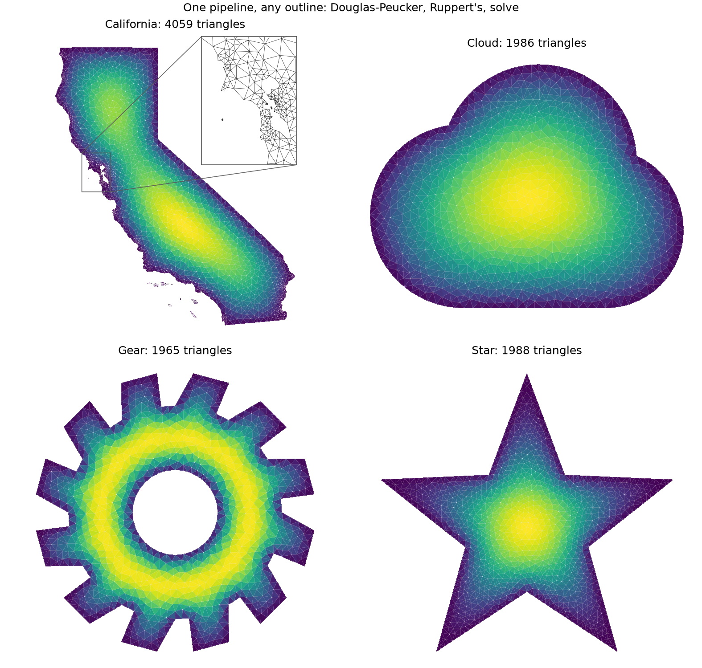</p>

Boundary conditions are placed by *position*, not by vertex index, so the same
specification lands on the same physical patch on any triangulation of the domain. Below,
one cantilever, clamped on the left and loaded on the right, is solved on a structured
grid and an unstructured Ruppert's mesh of the same beam: the conditions resolve against
each, and the two deflect the same. That is what lets a condition be written once and
survive whatever remeshing happens after, including adaptive refinement rebuilding the
mesh several times over.

<p align="center">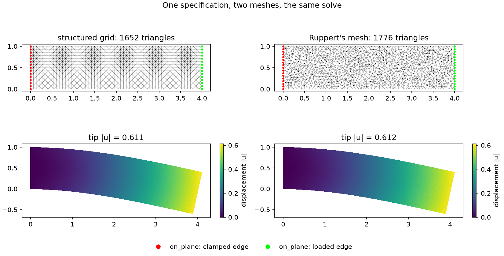</p>

## Solving PDEs

### Poisson's equation

Poisson's equation, $-\nabla^2 u = f$, models heat transfer, electrostatics, and other
steady diffusion. The finite element method takes its weak form and discretizes it into
a sparse linear system. The meshing section above already solves its "dome",
$-\nabla^2 u = 1$ pinned to zero on the boundary; the same scalar operator tells a
different story on a domain with a hole.

An ideal (incompressible, irrotational) flow has a velocity potential $\phi$ with
$\mathbf{v} = \nabla\phi$, so $\phi$ solves Laplace's equation (Poisson with $f = 0$).
The obstacle here is a NACA 2412 airfoil at a 12-degree angle of attack, generated from
the standard formula rather than a data file. A potential difference drives the flow
left to right; the wing carries no flow through it, which is exactly the natural
zero-flux condition of the weak form. Say nothing on its surface and it becomes a
streamline the flow parts around. The equipotentials crowd over the upper surface, where
the flow speeds up.

<p align="center">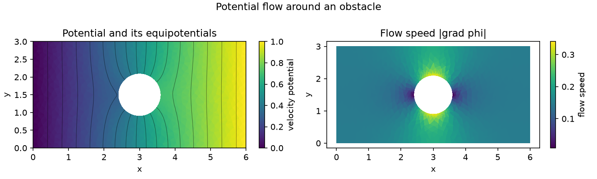</p>

### Heat equation

The heat equation, $\partial u / \partial t = \alpha \nabla^2 u$, describes how
temperature spreads over time. It is integrated with the theta-method, defaulting to
$\theta = \tfrac{1}{2}$ (Crank-Nicolson); $\theta = 1$ is backward Euler. A finned
heatsink is held hot underneath its base, and every other surface sheds heat to ambient
through a convective (Robin) film, $\partial u / \partial n + \kappa (u - u_\infty) = 0$.

Is the shape worth it? Compared against a solid block of the same size, posed two ways:
driven by the same chip power, the block runs about 108&deg;C above ambient while the
finned sink runs only 58&deg;C, roughly halving the thermal resistance; and holding each
base at the same temperature, the finned sink sheds about 1.8x the heat on two-thirds the
metal. Each fin also checks against beam theory (right): its efficiency, the heat it
sheds against what it would shed with all of it at the base temperature, follows the
textbook $\tanh(mL)/(mL)$ law, falling as fins lengthen because a long fin runs cold
toward the tip, so these fins sit near 40%. The fins trade material for surface area,
which is why a heatsink is finned rather than solid.

<p align="center">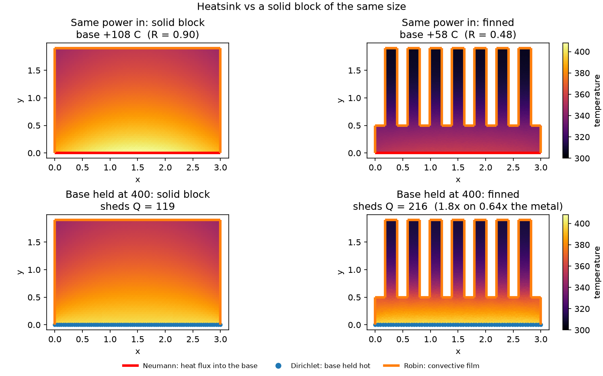 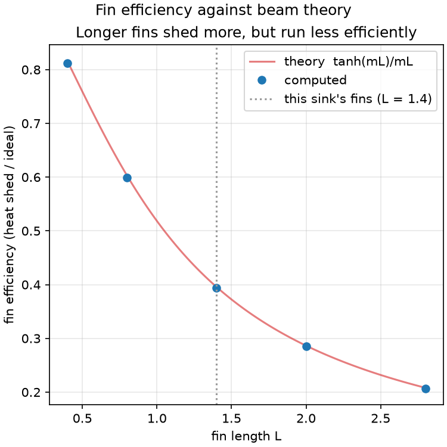</p>

### Wave equation

The wave equation, $\partial^2 u / \partial t^2 = c^2 \nabla^2 u$, is second order in
time, so it is integrated with Newmark's average-acceleration method rather than the
theta-method used for the first-order systems. A pulse released from rest spreads out,
reflects off the free boundary the same way up, and interferes with itself.

<p align="center">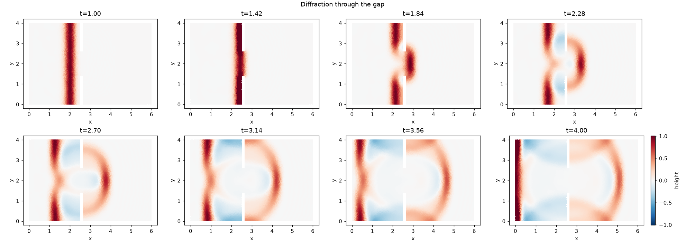</p>

## Solids & structures

### Linear elasticity, in 2D and 3D

The linear elastic solver recovers displacement and a full stress tensor from applied
forces and boundary conditions. A cantilever is clamped on the left and pulled down over
the middle of the right edge; the bending stress is largest at the clamp and splits
tension above the neutral axis from compression below. The same assembly, element
hierarchy, and stress recovery run one dimension up: the 3D panel is a tetrahedral
cantilever under the same clamp-and-load, solved with an AMG-preconditioned
conjugate-gradient backend where a direct factorization's fill-in starts to hurt, and
drawn as its boundary surface.

<p align="center">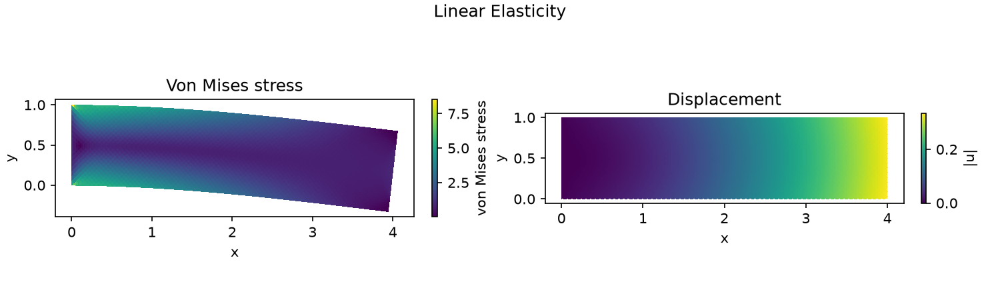</p>

One solve, one stress tensor, several rotation-invariant questions: von Mises,
mean normal stress, the Tresca measure, and the largest tensile principal value are
each a reduction of the same tensor rather than a separate problem.

### Stress at a re-entrant corner, and why fillets exist

An L-bracket clamped at the top and pulled down at the tip concentrates stress at its
inner corner. A *sharp* re-entrant corner is a genuine stress singularity: the exact
elastic stress there is infinite, so no mesh resolves it. Drive adaptive refinement into
the corner and the computed peak just keeps climbing. Round the corner with a fillet and
the singularity is gone: the peak spreads over the radius and settles on a finite value.
Tracking that corner peak against mesh size (right) shows the two behaviours directly:
the sharp corner climbs without bound (its "stress" is a property of the mesh, not the
part); the fillet converges. This is the whole reason real parts round their inner
corners.

<p align="center">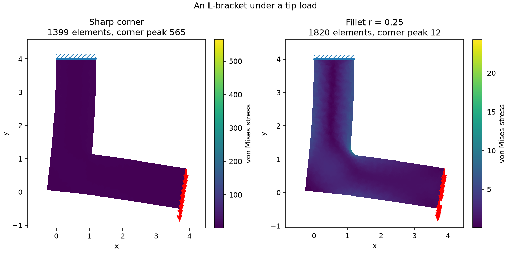 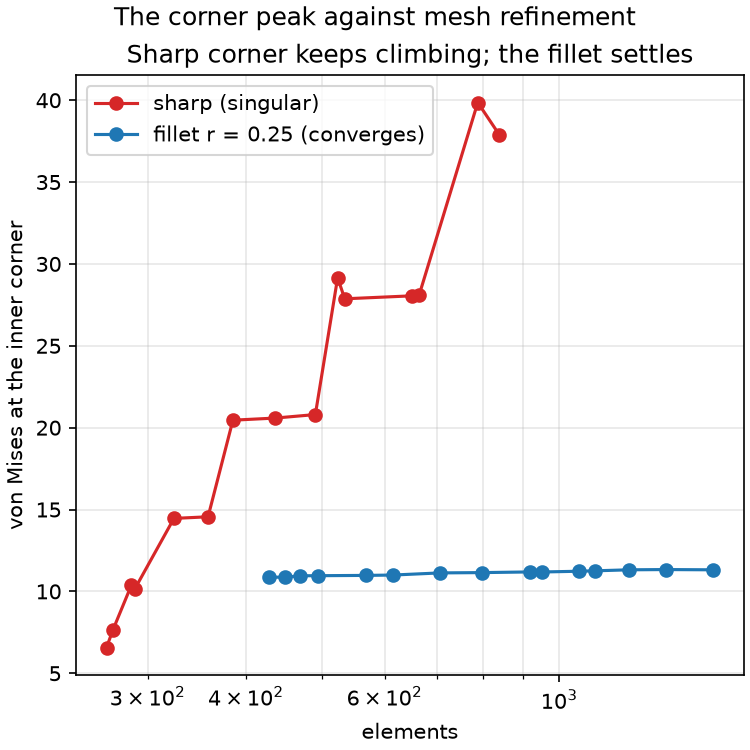</p>

### Three ways to solve the same stretch

The same clamped block is stretched three ways: a linear solve of $Ku = f$, the same
physics reached by Newton on the elastic energy that system is the stationary point of,
and a finite-strain (Green-Lagrange) solve. The first two agree in displacement to
machine precision; the third stiffens as the stretch grows, which small strain cannot.

<p align="center">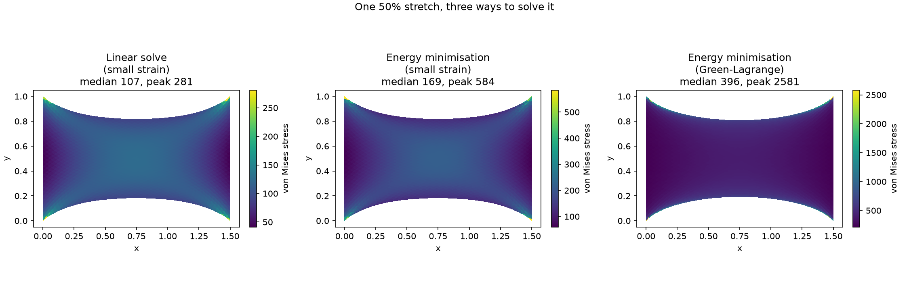</p>

### From an outline to a stress concentration

The one demo that runs the whole pipeline, in one row. A plate with a hole is meshed from
its outline, given roller and traction conditions (the rim is left traction-free, the
natural condition of the weak form), then adaptively refined toward the stress at the rim.
The stress crowds into the material either side of the hole and relaxes to the applied
value within about a diameter, peaking just above the classic Kirsch factor of 3 that
holds for a hole in an infinite plate (a finite plate reads a little higher).

<p align="center">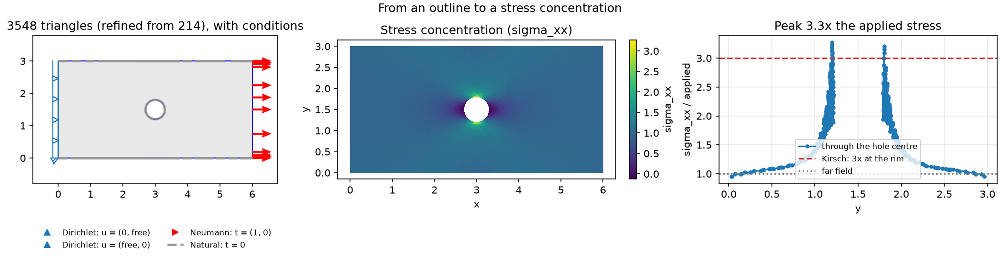</p>

### Buckling analysis

A slender column under compression does not fail by crushing; it snaps sideways once
the load crosses a critical value. `BucklingSolver` finds that value and the shapes by
*linearised (eigenvalue) buckling*: a reference load sets up a prestress, the geometric
stiffness $K_g$ assembled from it competes with the elastic stiffness $K$, and the
generalized eigenproblem $K \phi = -\lambda K_g \phi$ gives the critical load factors
and mode shapes. The column is meshed with P2 elements, which do not lock in bending
the way a constant-strain triangle does.

<p align="center">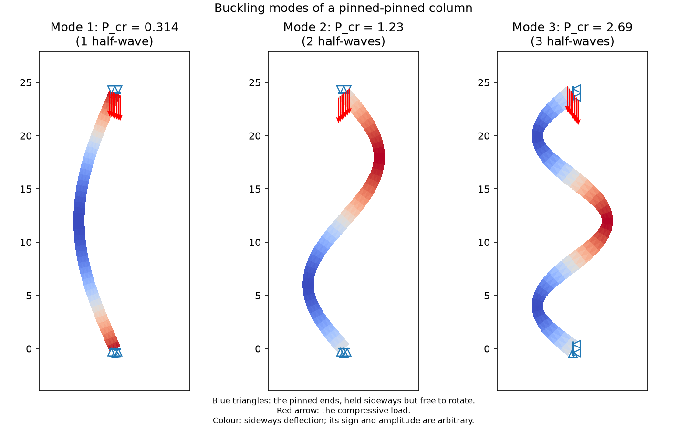</p>

### Modal (free-vibration) analysis

The same eigen-machinery, a different pencil. Free vibration solves
$K \phi = \omega^2 M \phi$ (no applied load; the modes are a property of the structure),
using the consistent mass matrix and a shift-invert about zero to pull the lowest
frequencies. A steel tuning fork is meshed from its own outline and held at the stem
base. Its low modes come in pairs; the one whose tines swing oppositely leaves the stem
still and rings, which is "the voice".

<p align="center">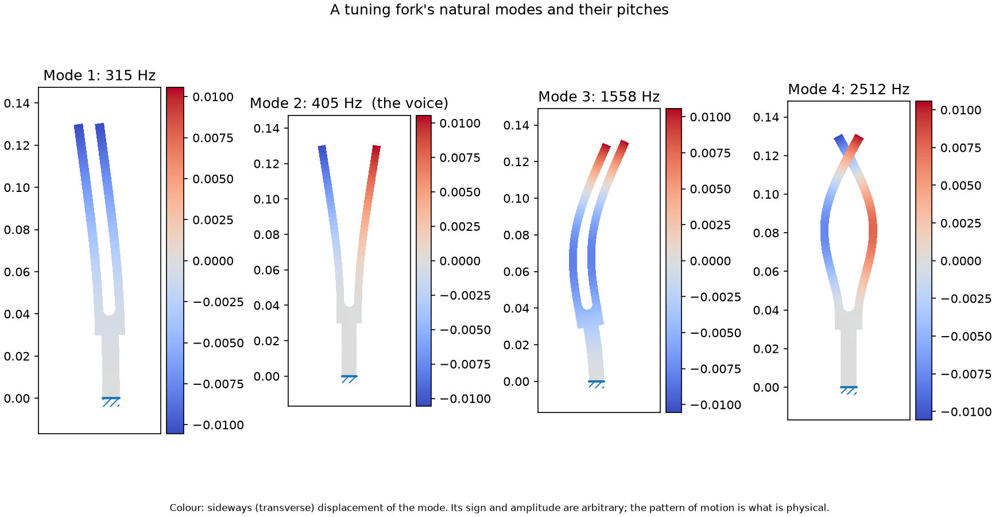</p>

### Topology optimization

Topology optimization distributes material to minimize compliance (deformation under
load). Here a simply supported beam carries a central load, and the SIMP (Solid Isotropic
Material with Penalization) method is asked for the stiffest structure using half the
material, penalizing intermediate densities so the design resolves toward solid-or-void.
It finds the classic arch: a compression arch over a tension tie, braced by a diagonal
web. Because compliance is the work the load does, it measures deflection directly, and
the optimized truss comes out only about 1.6x as compliant as the fully solid block on
half the material. What it removed was near the neutral axis, where the material was
barely resisting the bending.

<p align="center">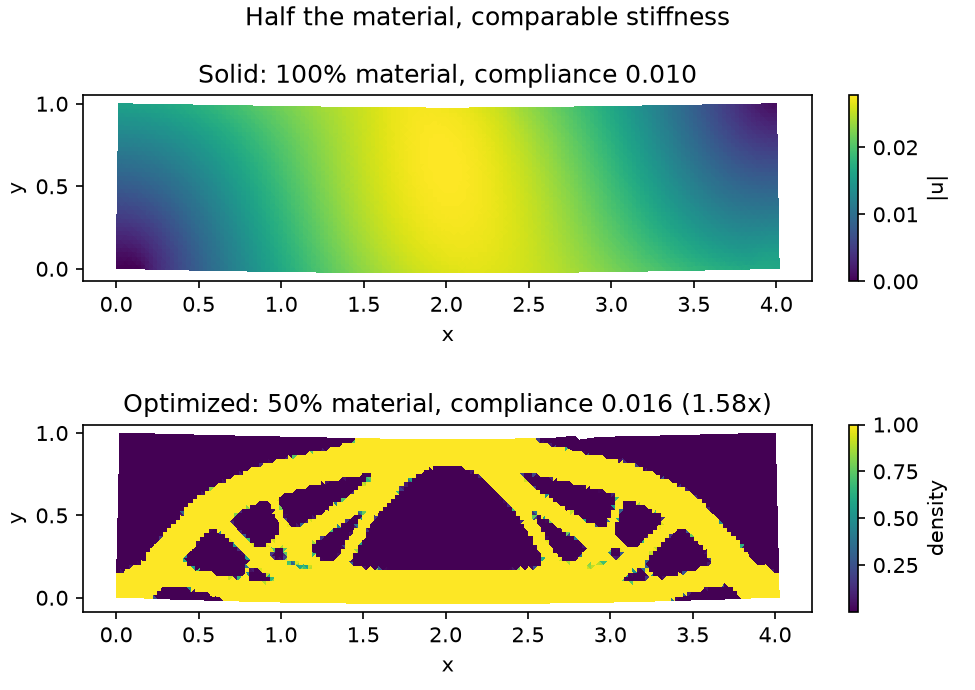</p>

The [gallery's topology page](https://janetyq.github.io/Finite-Element-Solver/topology_optimization.html)
plays the SIMP iterations frame by frame, from an even grey to the black-and-white truss.

## Accuracy & performance

### Convergence against manufactured solutions

The one place the solver plots not what it computed but how wrong it was. Against
exactly known (manufactured) solutions, P1 elements are second order in space (halve
$h$, quarter the error) for a scalar unknown and a coupled vector one alike; in time the
order is the theta-method's to choose, first at backward Euler and second at
Crank-Nicolson. Every rate here also runs as an assertion in the test suite.

<p align="center">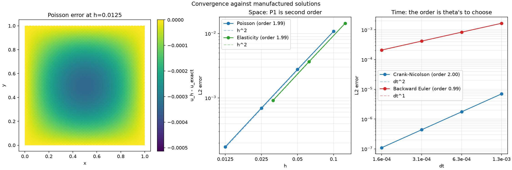</p>

### Higher-order elements

P2 (quadratic) triangles carry edge-midpoint DOFs that let the solution curve within an
element. On the same meshes they are third order in $L^2$ where P1 is second, and
reach a given accuracy with fewer degrees of freedom.

<p align="center">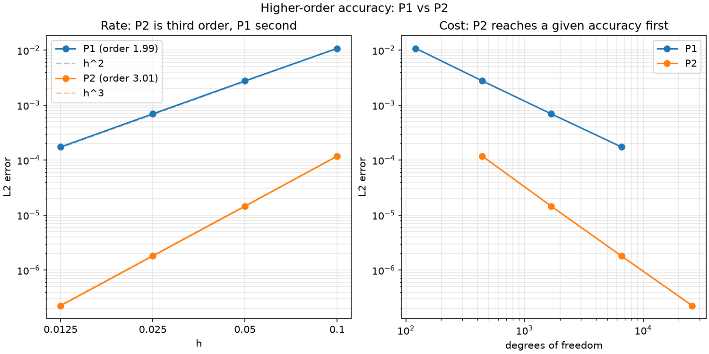</p>

Curved (isoparametric) boundary elements take this a step further. On a boundary that
carries an analytic curve (a `Circle` or `Arc`), an `IsoparametricTriangleElement`
places its edge-midpoint node on the true curve and differentiates the full geometry
map, so the element's boundary edge bends to follow it instead of cutting a chord.
Meshing carries the curve through, so Ruppert's split points and red-green refinement
project onto it and a circular hole stays round under refinement rather than becoming a
finer polygon. On an annulus the meshed area then converges at the element's own order
rather than the polygonal $O(h^2)$, and a coarsely sampled hole recovers the Kirsch
stress concentration that a straight facet under-resolves.

### Adaptive refinement

Adaptive refinement re-solves and splits wherever an a posteriori error estimator finds
the most error, maintaining triangle quality with red-green refinement. Two estimators
ship: a **residual** estimator (interior residual, interior-edge flux jump, and boundary
residual; 2D only, as it needs edge normals) and a **Zienkiewicz-Zhu recovery**
estimator (the gap between the discrete flux and a recovered continuous one;
dimension-general). Below, refinement driven by the residual estimator on a peaked
Poisson source concentrates the mesh where the solution is hardest to approximate, and
the estimated error drops sharply.

<p align="center">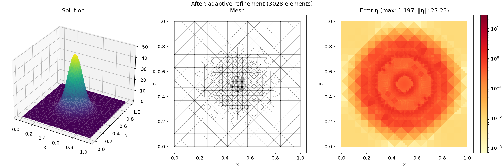</p>

### Representation error

Before any PDE, there is the question of what the space can represent at all. The target
$\sin(40 r^2)$ has rings that tighten with radius; projected onto a deliberately coarse
P1 mesh, the slow inner rings come through but the fast outer ones break up into the
triangulation. That representation error is the floor every solver on this mesh starts
from, and refining the mesh is what lowers it.

<p align="center">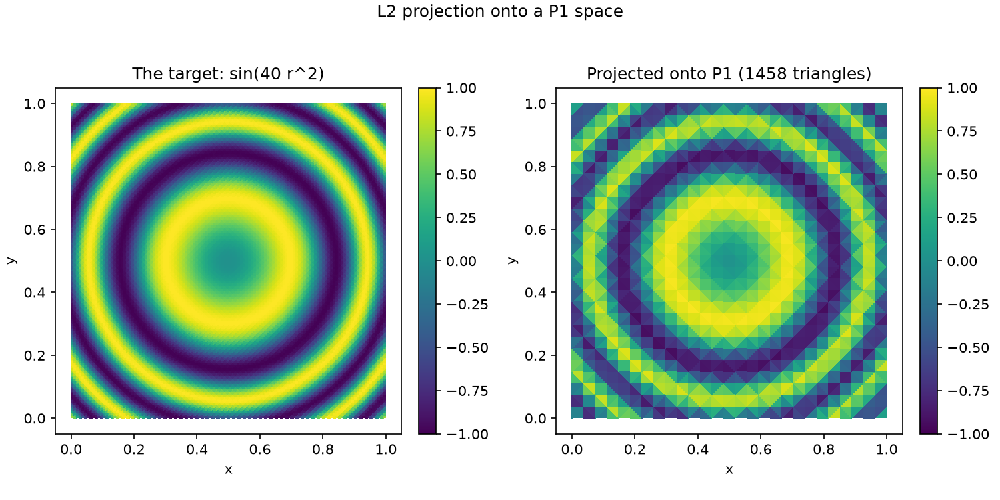</p>

---

## Quick Start

```python
from fem import create_rect_mesh, BoundaryConditions, BCType, Solver, Poisson, Plotter
from fem.regions import everywhere

mesh = create_rect_mesh(corners=[[0, 0], [1, 1]], resolution=(40, 40))  # geometry only

# The source term f is data of the equation; the boundary conditions describe only the
# boundary, and do so geometrically, so the same `bc` is valid on any mesh, including
# one produced by adaptive refinement.
equation = Poisson(source=1)
bc = BoundaryConditions()
bc.add(BCType.DIRICHLET, everywhere(), 0)

# Solver picks the element type off the connectivity and derives the DOFs per node from
# the equation, so it builds its own FunctionSpace over the mesh.
solution = Solver(mesh, equation, bc).solve()

plotter = Plotter(title="Poisson")
plotter.plot(mesh, solution.u, mode="surface")
plotter.show()
```

A solution is a typed dataclass, so its fields are attributes rather than string keys.
An elastic solve returns an `ElasticSolution`, which carries the recovered stress and
strain as full tensors and derives the scalar measures on demand:

```python
solution = Solver(mesh, LinearElastic(E=200, nu=0.3), bc).solve()

solution.u                 # (n_vertices * n_components,) displacement
solution.stress            # (n_elements, 3, 3) Cauchy stress tensors
solution.von_mises         # (n_elements,) equivalent stress, the usual plot
solution.principal_stress  # (n_elements, 3) principal values, ascending
solution.compliance        # (n_elements,) strain energy per element
```

The tensors are stored and the scalars computed, not the other way round. A reduction
to one number is a choice, and reducing at construction would fix which question the
result can answer. `fem/invariants.py` holds those reductions; each is
rotation-invariant, which a norm taken over the packed Voigt components used in
assembly is not.

## Installation

The project uses [uv](https://docs.astral.sh/uv/) for environment and dependency
management. `uv sync` creates a project-local `.venv`, installs the `fem` package in
editable mode, and pins exact versions in `uv.lock`.

```bash
uv sync   # core solver, SVG-outline and 3D tetrahedral meshing, and dev tools (pytest)
```

Prefer plain pip? It is a standard `pyproject.toml` package:
```bash
pip install -e .
```

## Running demos and tests

Runnable demos live in `examples/` (run from the repo root) behind a small CLI:
```bash
uv run python examples/cli.py list          # see every available demo
uv run python examples/cli.py run poisson   # run one by name
uv run python examples/cli.py gallery       # render them all as a browsable site
```

The test suite:
```bash
uv run pytest
```
`uv run ruff check` and `uv run pyright` gate CI alongside the tests.

## Project Structure

A solve is a composition assembled from parts, not a method looked up by PDE name, so
the package is grouped by the job each object does. `ARCHITECTURE.md` is the full
account; this is the map.

```
fem/                 # the solver package
├── mesh/            # Mesh geometry, generation, red-green refinement, SVG outlines
├── plot/            # Plotter, 2D drawing helpers, 3D tet rendering
│
│   # discretization: what functions can be represented
├── elements.py      # stateless element types (P1/P2) + batched ElementGeometry
├── quadrature.py    # reference-simplex Gauss rules, wired into assembly
├── space.py         # FunctionSpace: DOF numbering, cached operators, assembly
│
│   # physics: what equation, what material
├── equations.py     # Equation: Projection, Poisson, LinearElastic
├── forms.py         # Form/EnergyForm integrands; derived-field recovery
├── materials.py     # Hooke's law, Lame conversions (2D is plane strain)
├── energies.py      # hyperelastic strain-energy densities and their derivatives
├── fields.py        # Scalar/Vector: components per node, resolved against the mesh
│
│   # constraints
├── boundary.py      # BoundaryConditions spec -> ResolvedBC for one mesh
├── regions.py       # position-based regions and fields (on_plane, in_box, ...)
│
│   # composition and algebra
├── problem.py       # Problem: space + operator + load + constraints
├── solve.py         # LinearSolve / NewtonSolve / EigenSolve strategies
├── system.py        # DiscreteSystem: Dirichlet elimination, factor once
├── backends.py      # DirectBackend (sparse LU) / IterativeBackend (AMG-CG)
├── integrators.py   # ThetaMethod (1st order), NewmarkMethod (2nd order)
│
│   # facades and drivers
├── solver.py        # Solver: the steady linear facade
├── energy_solver.py # EnergySolver: the nonlinear facade
├── buckling.py      # BucklingSolver: linearised (eigenvalue) buckling
├── modal.py         # ModalSolver: free-vibration analysis
├── adaptivity.py    # AdaptiveRefinement driver
├── estimators.py    # residual and Zienkiewicz-Zhu recovery error estimators
├── topology.py      # SIMP topology optimization driver
│
│   # results
├── solution.py      # typed Solution hierarchy; ElasticSolution.from_solve
├── invariants.py    # rotation-invariant tensor reductions (von Mises, ...)
├── convergence.py   # manufactured-solution studies and error norms
├── io.py            # mesh JSON, solution npz (no pickle)
│
└── geometry.py, numerics.py, typing.py   # helpers and semantic array aliases
tests/               # pytest suite (unit, convergence, integration smoke)
examples/            # runnable demo scripts, the CLI, and the gallery builder
files/               # example SVG outlines
```

The figures in this README are committed PNGs, a curated subset of the gallery's
renders, refreshed by hand rather than in CI. After changing a demo, regenerate them
and commit the result:

```bash
uv run python examples/make_readme_figures.py   # rewrites the figures in images/
```

## Methods

- Galerkin finite element method: P1 (linear) basis on triangles and tetrahedra, and
  P2 (quadratic) triangles for O(h³) accuracy, over a Gaussian quadrature layer
- Boundary conditions: Dirichlet, Neumann, Robin, and per-component (roller) constraints
- PDEs: L2 projection, Poisson, variable-coefficient diffusion, heat, wave,
  Navier-Cauchy (linear elasticity), St Venant-Kirchhoff hyperelasticity
- Kinematics: infinitesimal strain, or geometrically exact Green-Lagrange
  (2D elasticity is **plane strain**)
- Time integration: theta-method (backward Euler, Crank-Nicolson) for first-order
  systems; Newmark average-acceleration for second-order
- Linear algebra: sparse throughout; direct (`splu`) by default, or AMG-preconditioned
  CG for large SPD systems, with a rigid-body near-kernel for elasticity
- Eigen-analysis: linearised (eigenvalue) buckling and free-vibration (modal) analysis,
  a geometric-stiffness or mass pencil and a sparse generalized eigensolve
- Derived fields: Cauchy stress and strain tensors, von Mises, principal stresses,
  compliance
- Error estimation: residual and Zienkiewicz-Zhu recovery estimators, driving
  closed-loop adaptive refinement
- Optimization: Newton-Raphson with an optional backtracking line search; optimality
  criteria (SIMP topology optimization)
- Mesh algorithms: Delaunay triangulation, Ruppert's algorithm (line segments to
  triangle mesh), red-green refinement

## Roadmap

`BACKLOG.md` tracks the detailed open work; this is the direction.

- **Broaden the physics**: thermoelasticity, plasticity, fluids (Stokes / Navier-Stokes),
  electrostatics, advection-diffusion, Neo-Hookean
- **Differentiable / adjoint solve**: inverse problems, design and shape optimization,
  goal-oriented refinement
- **Standard formats**: STL and OBJ meshes, Gmsh `.msh` import, VTK/ParaView `.vtu` export
- **Standard benchmark suite**: NAFEMS, Cook's membrane, plate-with-hole, L-shaped
  singularity, Euler columns
- **Finish the core**: 3D P2 with P2-aware plotting and adaptivity, mixed (u-p) for
  near-incompressibility, time-varying loads, two-grid preconditioner

## References

*The Finite Element Method: Theory, Implementation, and Applications* by Mats G. Larson
and Fredrik Bengzon.

[*SIMP Method for Topology Optimization*](https://help.solidworks.com/2019/english/solidworks/cworks/c_simp_method_topology.htm)
by Dassault Systèmes.
