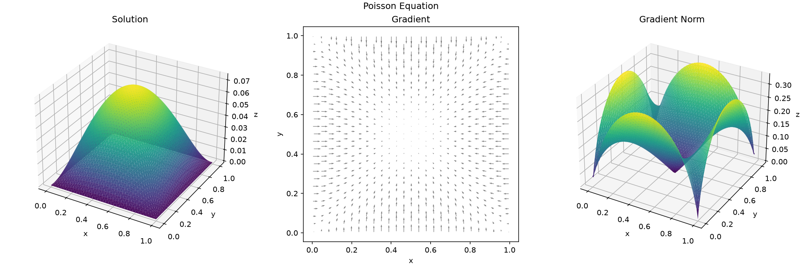
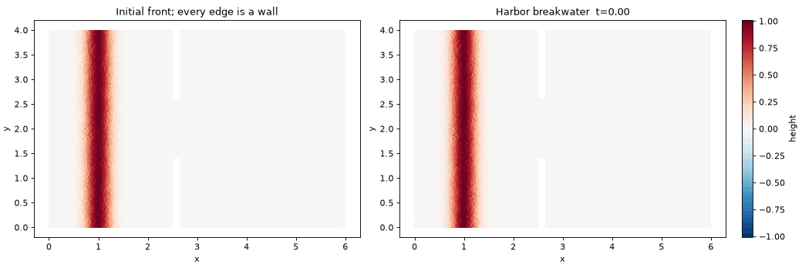

# Finite Element Solver

[](https://github.com/janetyq/Finite-Element-Solver/actions/workflows/ci.yml)
[](https://janetyq.github.io/Finite-Element-Solver/)

A finite element method (FEM) solver written from scratch in Python. It meshes a
domain, assembles the discrete system, and solves the Poisson, heat, wave, and linear
and nonlinear elasticity equations in 2D and 3D. Boundary conditions can be Dirichlet,
Neumann, or Robin, and are described geometrically so one specification survives a
remesh. It also includes its own meshing (Delaunay, Ruppert's algorithm, red-green
refinement), adaptive refinement driven by a posteriori error estimators, quadratic
and curved elements, buckling and modal analysis, adjoint sensitivities, and SIMP
topology optimization.

### ▶ [See it running: the demo gallery](https://janetyq.github.io/Finite-Element-Solver/)

The [gallery](https://janetyq.github.io/Finite-Element-Solver/) renders every demo
beside the code that produced it and is rebuilt on each push to `main`. The figures
below are a subset of it, with the full captions in the gallery.

---

## Meshing a domain

The library includes its own meshing. An outline, traced from an SVG or generated, is
simplified with Douglas-Peucker, triangulated with Ruppert's algorithm to a
minimum-angle and maximum-area bound, and can then be adaptively refined where the
solution needs it (shown in later demos). Below, the same Poisson problem
($-\nabla^2 u = 1$ with $u = 0$ on the boundary) is solved on four outlines. Each asks
something different of the mesher: disconnected islands, Bezier curves, a hole, and
sharp notches.

<!-- Figures: HTML img inside <p align="center">, not markdown images, so they can be sized and paired.
     Compact figures get height (about 400); wide ones get width (about 780) since a tall height on a wide
     image makes GitHub squish it. Side-by-side pairs share one <p> at a height that fits both in the column.
     PNGs come from examples/make_readme_figures.py. -->

<p align="center"></p>

## Solving PDEs

### Poisson's equation

Poisson's equation, $-\nabla^2 u = f$, models heat transfer, electrostatics, and other
steady diffusion. The meshing section above solves it with a constant source; with
no source it is Laplace's equation, which here gives a flow. An ideal (incompressible,
irrotational) flow has a velocity potential $\phi$ with $\mathbf{v} = \nabla\phi$, and
$\phi$ solves Laplace's equation. The obstacle is a NACA 2412 airfoil at a 12-degree
angle of attack. A potential difference drives the flow left to right. The wing
carries no boundary condition at all, which in the weak form is the natural zero-flux
condition, so it becomes a streamline the flow parts around. The equipotentials crowd
over the upper surface, where the flow speeds up.

<p align="center"></p>

### Heat equation

The heat equation, $\partial u / \partial t = \alpha \nabla^2 u$, describes how
temperature spreads over time. It is integrated with the theta-method, defaulting to
$\theta = \tfrac{1}{2}$ (Crank-Nicolson); $\theta = 1$ is backward Euler. A finned
heatsink is held hot underneath its base, and every other surface sheds heat to ambient
through a convective (Robin) film, $\partial u / \partial n + \kappa (u - u_\infty) = 0$.

The finned sink is compared against a solid block of the same size. Driven by the
same chip power, the block runs about 108&deg;C above ambient while the finned sink
runs 58&deg;C, roughly halving the thermal resistance. Held at the same base
temperature, the finned sink sheds about 1.8x the heat with two-thirds the metal. The
fin efficiency (right), the heat a fin sheds relative to what it would shed at the base
temperature throughout, follows the textbook $\tanh(mL)/(mL)$ law and falls as fins
lengthen, since a long fin runs cold toward the tip.

<p align="center"> </p>

### Wave equation

The wave equation, $\partial^2 u / \partial t^2 = c^2 \nabla^2 u$, is second order in
time and is integrated with Newmark's average-acceleration method. Below, a wave
front meets a harbor breakwater: it reflects off the wall and passes the gap, where it
spreads into the sheltered water as a circular wave centred on the opening.

<p align="center"></p>

## Solids & structures

### Linear elasticity, in 2D and 3D

The linear elastic solver computes the displacement and the full stress tensor from
applied loads and boundary conditions. A cantilever is clamped on the left and pulled
down over the middle of the right edge. The bending stress is largest at the clamp,
with tension above the neutral axis and compression below. The 3D panel is a
tetrahedral cantilever under the same clamp and load, drawn as its boundary surface.
It is solved with AMG-preconditioned conjugate gradients, since in 3D a direct
factorization's fill-in starts to hurt.

<p align="center"></p>

One solve gives one stress tensor, and the four 2D stress panels are
rotation-invariant reductions of it: von Mises, mean normal stress, the Tresca
measure, and the largest tensile principal value.

### Stress at a re-entrant corner, and why fillets exist

An L-bracket clamped at the top and pulled down at the tip concentrates stress at its
inner corner. A sharp re-entrant corner is a stress singularity, where the exact
elastic stress is infinite, so no mesh resolves it and adaptive refinement into the
corner keeps the computed peak climbing. A fillet removes the singularity and the
peak settles on a finite value. The plot on the right tracks the corner peak against
mesh size for both. The sharp corner climbs without bound, so the stress it reports
is a property of the mesh rather than the part, while the fillet converges. This is
why real parts round their inner corners.

<p align="center"> </p>

### Three ways to solve the same stretch

The same clamped block is stretched three ways. The first is `LinearElastic`, a linear
solve of $Ku = f$. The second minimises that model's elastic energy with Newton's
method, and arrives at the same system from the other direction. The third is
`FiniteStrainElastic`, a Green-Lagrange solve. The first two agree in displacement to
machine precision. The third stiffens as the stretch grows, which small strain cannot.

<p align="center"></p>

### From an outline to a stress concentration

This demo runs the whole pipeline. A plate with a hole is meshed from its outline,
given roller and traction conditions (the rim is left traction-free), solved on curved
quadratic elements, and adaptively refined toward the stress at the rim. The stress
crowds into the material either side of the hole and relaxes to the applied value
within about a diameter. At the rim it peaks at 3.03x the applied stress. The classic
Kirsch factor is 3 for a hole in an infinite plate, and Howland's value for a hole a
tenth of this plate's width is 3.02.

<p align="center"></p>

### Buckling analysis

A slender column under compression does not fail by crushing. It snaps sideways once
the load crosses a critical value. `BucklingAnalysis` finds that value and the buckled
shapes by linearised (eigenvalue) buckling. A reference load sets up a prestress, the
geometric stiffness $K_g$ is assembled from it, and the generalized eigenproblem
$K \phi = -\lambda K_g \phi$ gives the critical load factors and mode shapes. The
column is meshed with P2 elements, which do not lock in bending the way a
constant-strain triangle does.

<p align="center"></p>

### Modal (free-vibration) analysis

Free vibration solves $K \phi = \omega^2 M \phi$ with the consistent mass matrix, using
shift-invert about zero to find the lowest frequencies. No load is applied, so the
modes are a property of the structure alone. A steel tuning fork is meshed from its
outline and held at the stem base. Its low modes come in pairs, and the one whose
tines swing in opposite directions leaves the stem still and rings; that is the
fork's voice.

<p align="center"></p>

### Topology optimization

Topology optimization distributes material to minimize compliance (deformation under
load). Here a simply supported beam carries a central load, and the SIMP (Solid
Isotropic Material with Penalization) method finds the stiffest structure using half
the material, penalizing intermediate densities so the design resolves toward solid or
void. It finds the classic arch, a compression arch over a tension tie braced by a
diagonal web. Compliance is the work the load does, so it measures deflection
directly, and the optimized truss is only about 1.6x as compliant as the fully solid
block on half the material. What it removed was near the neutral axis, where the
material was barely resisting the bending.

<p align="center"></p>

The [gallery's topology page](https://janetyq.github.io/Finite-Element-Solver/topology_optimization.html)
plays the SIMP iterations frame by frame, from an even grey to the black-and-white truss.

## Accuracy & performance

### Convergence against manufactured solutions

Against exactly known (manufactured) solutions, P1 elements are second order in space
(halve $h$, quarter the error) for both a scalar unknown and a coupled vector one, and
P2 elements third. In time, backward Euler is first order and Crank-Nicolson second.
How the load is built
matters too: sampling the source at the quadrature points instead of reading it at
the vertices keeps the rate and improves the constant about 3x. Every rate here also
runs as an assertion in the test suite.

<p align="center"></p>

### Higher-order elements

P2 (quadratic) triangles carry edge-midpoint DOFs that let the solution curve within an
element. On the same meshes they are third order in $L^2$ where P1 is second (top
left above), and reach a given accuracy with fewer degrees of freedom (top right).

Curved (isoparametric) boundary elements go a step further. On a boundary that
carries an analytic curve (a `Circle` or `Arc`), an `IsoparametricTriangleElement`
places its edge-midpoint node on the true curve, so the element's boundary edge
follows the curve instead of cutting a chord. Meshing carries the curve through, so
Ruppert's split points and red-green refinement project onto it and a circular hole
stays round under refinement. The meshed area then converges at the element's own
order rather than the polygonal $O(h^2)$; the hole-in-plate and bracket demos above
run on these elements.

### Adaptive refinement

Adaptive refinement re-solves and splits wherever an a posteriori error estimator finds
the most error, keeping triangle quality with red-green refinement. There are three
estimators. The residual estimator measures the interior residual, the flux jump
across edges, and the boundary residual (2D only). The Zienkiewicz-Zhu recovery
estimator measures the gap between the discrete flux and a recovered continuous one.
The goal-oriented estimator refines toward a chosen quantity of interest through an
adjoint solve. Below, the residual estimator on a peaked Poisson source concentrates
the mesh where the solution is hardest to approximate, and reaches a given error with
about a third of the unknowns uniform refinement needs (the gallery has the chart).

<p align="center"></p>

### Representation error

Before any PDE is solved, the mesh already limits what its P1 space can represent.
The target $\sin(40 r^2)$ has rings that tighten with radius. Projected onto a coarse
P1 mesh, the slow inner rings come through but the fast outer ones break up into the
triangulation. This representation error is the floor every solver on this mesh
starts from, and refining the mesh is what lowers it.

<p align="center"></p>

---

## Quick Start

```python
from fem import create_rect_mesh, BoundaryConditions, BCType, Solver, Poisson, Plotter
from fem.regions import everywhere

mesh = create_rect_mesh(corners=[[0, 0], [1, 1]], resolution=(40, 40))

# Conditions are geometric, so the same `bc` is valid on any mesh of this domain.
equation = Poisson(source=1)
bc = BoundaryConditions()
bc.add(BCType.DIRICHLET, everywhere(), 0)

solution = Solver(mesh, equation, bc).solve()

plotter = Plotter(title="Poisson")
plotter.plot(mesh, solution.u, mode="surface")
plotter.show()
```

`Solver` is a convenience over the parts, which compose directly. The same solve, by hand:

```python
from fem import FunctionSpace, LinearProblem, LaplacianForm

space = FunctionSpace(mesh, n_components=1)
problem = LinearProblem(space, LaplacianForm(), source=1, bc=bc)
solution = problem.solve()
```

`problem.solve()` picks `LinearSolve` for a constant tangent and Newton otherwise; pass
`strategy=` or `backend=` to choose. `equation.problem(mesh, bc)` builds the same problem
from a named equation.

Swap the form, the source, the boundary conditions, the element type, the solve strategy, or the
linear-algebra backend independently; `ARCHITECTURE.md` lists the steps and their options.

A solution is a typed dataclass. An elastic solve returns an `ElasticSolution`, which
carries the stress and strain as full tensors and derives the scalar measures on
demand:

```python
solution = Solver(mesh, LinearElastic(E=200, nu=0.3), bc).solve()

solution.u                 # (n_vertices * n_components,) displacement
solution.stress            # (n_elements, 3, 3) Cauchy stress tensors
solution.von_mises         # (n_elements,) equivalent stress, the usual plot
solution.principal_stress  # (n_elements, 3) principal values, ascending
solution.compliance        # (n_elements,) strain energy per element
```

`fem/invariants.py` holds those reductions; each is rotation-invariant.

## Installation

The project uses [uv](https://docs.astral.sh/uv/) for environment and dependency
management. `uv sync` creates a project-local `.venv`, installs the `fem` package in
editable mode, and pins exact versions in `uv.lock`.

```bash
uv sync   # core solver, SVG-outline and 3D tetrahedral meshing, and dev tools (pytest)
```

Prefer plain pip? It is a standard `pyproject.toml` package:
```bash
pip install -e .
```

## Running demos and tests

Runnable demos live in `examples/` (run from the repo root) behind a small CLI:
```bash
uv run python examples/cli.py list          # see every available demo
uv run python examples/cli.py run poisson   # run one by name
uv run python examples/cli.py gallery       # render them all as a browsable site
```

The test suite:
```bash
uv run pytest
```
`uv run ruff check` and `uv run pyright` gate CI alongside the tests.

## Project Structure

The package is grouped by the job each object does. `ARCHITECTURE.md` is the overview;
this is the map.

```
fem/                 # the solver package
├── mesh/            # Mesh geometry, generation, red-green refinement, SVG outlines
├── plot/            # Plotter, 2D drawing helpers, 3D tet rendering
│
│   # discretization: what functions can be represented
├── elements.py      # stateless element types (P1/P2) + batched ElementGeometry
├── quadrature.py    # reference-simplex Gauss rules, wired into assembly
├── space.py         # FunctionSpace: DOF numbering, cached operators, assembly
│
│   # physics: what equation, what material
├── equations.py     # Equation: Projection, Poisson, LinearElastic, FiniteStrainElastic
├── forms.py         # Form: bilinear and energy integrands; derived-field recovery
├── materials.py     # Hooke's law, Lame conversions (2D is plane strain)
├── energies.py      # hyperelastic strain-energy densities and their derivatives
├── fields.py        # Scalar/Vector: components per node, resolved against the mesh
│
│   # constraints
├── boundary.py      # BoundaryConditions spec -> ResolvedBC for one mesh
├── regions.py       # position-based regions and fields (on_plane, in_box, ...)
│
│   # composition and algebra
├── problem.py       # Problem: space + operator + load + constraints
├── solve.py         # LinearSolve / NewtonSolve / EigenSolve strategies
├── system.py        # DiscreteSystem: Dirichlet elimination, factor once
├── backends.py      # DirectBackend (sparse LU) / IterativeBackend (AMG-CG)
├── integrators.py   # ThetaMethod (1st order), NewmarkMethod (2nd order)
│
│   # facades and drivers
├── solver.py        # Solver: the steady facade, linear or Newton by the problem
├── buckling.py      # BucklingAnalysis: linearised (eigenvalue) buckling of a Problem
├── modal.py         # ModalAnalysis: free-vibration modes of a Problem
├── adaptivity.py    # AdaptiveRefinement driver
├── estimators.py    # residual, recovery, and goal-oriented error estimators
├── sensitivity.py   # adjoint sensitivity: quantities of interest and their gradients
├── design.py        # SIMPModel + DesignOptimizer: density (topology) design over any quantity of interest
│
│   # results
├── solution.py      # typed Solution hierarchy; ElasticSolution.from_solve
├── invariants.py    # rotation-invariant tensor reductions (von Mises, ...)
├── convergence.py   # manufactured-solution studies and error norms
├── io.py            # mesh JSON, solution npz (no pickle)
│
└── geometry.py, numerics.py, typing.py   # helpers and semantic array aliases
tests/               # pytest suite
examples/            # runnable demo scripts, the CLI, and the gallery builder
files/               # example SVG outlines
```

The figures in this README are committed images (PNGs and one GIF), refreshed by
hand. After changing a demo, regenerate them and commit the result:

```bash
uv run python examples/make_readme_figures.py   # rewrites the figures in images/
```

## Methods

- Galerkin finite element method: P1 (linear) basis on triangles and tetrahedra, P2
  (quadratic) and curved isoparametric triangles, over a Gaussian quadrature layer
- Boundary conditions: Dirichlet, Neumann, Robin, and per-component (roller) constraints
- PDEs: L2 projection, Poisson, variable-coefficient diffusion, heat, wave, and two
  elastic models: `LinearElastic` (infinitesimal strain, Navier-Cauchy) and
  `FiniteStrainElastic` (geometrically exact Green-Lagrange strain under a
  hyperelastic law, St Venant-Kirchhoff by default); 2D elasticity is plane strain
- Time integration: theta-method (backward Euler, Crank-Nicolson) for first-order
  systems; Newmark average-acceleration for second-order
- Linear algebra: sparse throughout; direct (`splu`) by default, or AMG-preconditioned
  CG for large SPD systems, with a rigid-body near-kernel for elasticity
- Eigen-analysis: linearised (eigenvalue) buckling and free-vibration (modal) analysis,
  a geometric-stiffness or mass pencil and a sparse generalized eigensolve
- Derived fields: Cauchy stress and strain tensors, von Mises, principal stresses,
  compliance
- Error estimation: residual, Zienkiewicz-Zhu recovery, and goal-oriented (dual-weighted
  residual) estimators, driving closed-loop adaptive refinement
- Sensitivity and optimization: adjoint gradients of a quantity of interest;
  Newton-Raphson with an optional backtracking line search; optimality criteria (SIMP
  topology and design optimization)
- Mesh algorithms: Delaunay triangulation, Ruppert's algorithm (line segments to
  triangle mesh), red-green refinement

## Roadmap

`BACKLOG.md` tracks the detailed open work; this is the direction.

- Broaden the physics: thermoelasticity, plasticity, fluids (Stokes / Navier-Stokes),
  electrostatics, advection-diffusion, Neo-Hookean
- Inverse problems and shape optimization on the adjoint core
- Standard formats: STL and OBJ meshes, Gmsh `.msh` import, VTK/ParaView `.vtu` export
- Standard benchmark suite: NAFEMS, Cook's membrane, plate-with-hole, L-shaped
  singularity, Euler columns
- Finish the core: 3D P2 with P2-aware plotting and adaptivity, mixed (u-p) for
  near-incompressibility, time-varying loads, two-grid preconditioner

## References

*The Finite Element Method: Theory, Implementation, and Applications* by Mats G. Larson
and Fredrik Bengzon.

[*SIMP Method for Topology Optimization*](https://help.solidworks.com/2019/english/solidworks/cworks/c_simp_method_topology.htm)
by Dassault Systèmes.
